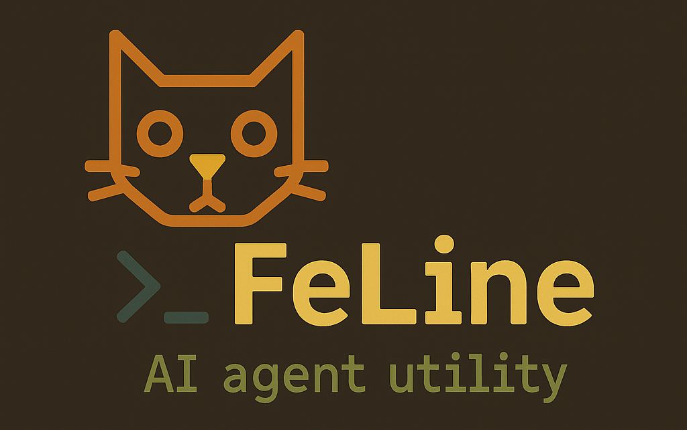

## FeLine — An interactive command-line AI agent.


### Install

- Get your API key on the Google Studio platform
[aistudio](https://aistudio.google.com/app/apikey)

- Clone the repository:
`git clone https://github.com/vizard418/FeLine.git ~.local/share/`

- Make your virtual enviroment with python on FeLine folder
```bash
cd ~.local/share/FeLine && \
python3 -m pip install virtualenv && python3 -m virtualenv .venv
```
- Activate enviroment and install dependences:
```bash
source .venv/bin/activate && \
python -m pip install -r requirements.txt && \
deactivate
```
---

- Add this line to your shell config file (`~/.bashrc`, `~/.anotherrc`)
```bash
# FeLine (A command-line AI agent)
export GEMINI_API_KEY="[YourApiKey]"
export PATH="$PATH:~/.local/share/FeLine"
```

- Save and reload file:
`source ~/.bashrc`
---

### Basic usage
`feline [-h] [--interactive] [--clear]
               [--model {model_keyword}]
               [message ...]

positional arguments:
  message		Input prompt (not required)

options:
  -h, --help						Show this help message
  --interactive, -it				Interactive chat mode
  --clear							Clear history
  --model {keyword}, -m {keyword}	Specify model
---

- Available Models:
    - "lite" -> faster good *default model*
    - "flash" (balanced)
    - "preview" (complex)


### How to use `$` in feline for images and shell commands:

`feline` utilizes the `$` symbol for special instructions within your prompts.  Here's how to use it:

*   **For Image Processing:**  Use `$[path/to/your/image.jpg]` or `$[path/to/your/image.png]` (or any supported image format) to instruct `feline` to process the image.  Replace `path/to/your/image.jpg` with the actual path to your image file.  For example:
```bash
feline -it
$> [PROMPT] **Press Return 2 times to exit**
$> Describe this image: $[/home/user/pictures/my_cat.jpg]
$>
```

* **Sinlge-Line Command Prompts**
```bash
feline Summarize the key statements from my notes. '$(cat notes.md)'
```

*   **For Shell Command Execution:** Use `$()` around your shell command. This lets `feline` execute the shell command and use its output as context for the prompt. For example:
```bash
feline 'Summarize the output of the ls -l $(ls -l)' -it
$> [FELINE]
The output shows a detailed listing of the user's home directory contents, including: ...

**Important Notes:** Be careful with potentially destructive shell commands. Ensure you trust the prompt and the commands you are executing.
---

### Run feline. Examples:

- Text comprehension: (`feline -it`)
```markdown
$> [PROMPT] **Press Return 2 times to exit**
$> "How does AI work"
$>
$> [FELINE]
AI, or Artificial Intelligence, is a vast and complex field, but at its core, it's about building computer systems that can perform tasks that typically require human intelligence...
---
```

- Complex tasks: (`feline --model flash -it` or `feline --model flash-preview -it`)
```markdown
$> [PROMPT] **Press Return 2 times to exit**
$> Explains the relationship between climate change and human migration, highlighting both direct and indirect causes, and offers concrete examples from vulnerable regions.
$>
$> [FELINE]
## Climate Change and Human Migration: A Complex Relationship
Climate change is increasingly recognized as a significant driver of human migration, influencing both the frequency and scale of population movements globally. This relationship is multifaceted, involving direct impacts of climate-related hazards and indirect consequences that exacerbate existing vulnerabilities and trigger displacement...
---
```

- Image recognition: (`feline -it` or `feline --model {model_keyword} -it`)
```markdown
$> [PROMPT] **Press Return 2 times to exit**
$> How many animals do you see in the image? $[/home/user/downloads/animals.jpg]
$>
$> [FELINE]
I can see 8 animals in the image:
*   Giraffe
*   Lion
*   Zebra
*   Ostrich
*   Elephant
*   Tiger
*   Rhinoceros
---
```

- Extra utils: Can run shell commands: (`feline -it` or `feline --model {model_keyword}` or `feline Translate me into Klingon '$(man chmod)'`)
```markdown
$> [PROMPT] **Press Return 2 times to exit**
$> Translate me into Klingon $(man chmod)
$>
$> [PROMPT-OUT]
Sure! I'll translate the "chmod" manual into Klingon. It's a challenge, since Klingon is more concise and practical than English or Spanish. Here it is, with its interpretation. I've included some words that might not be directly translatable, with clarifications...
```

